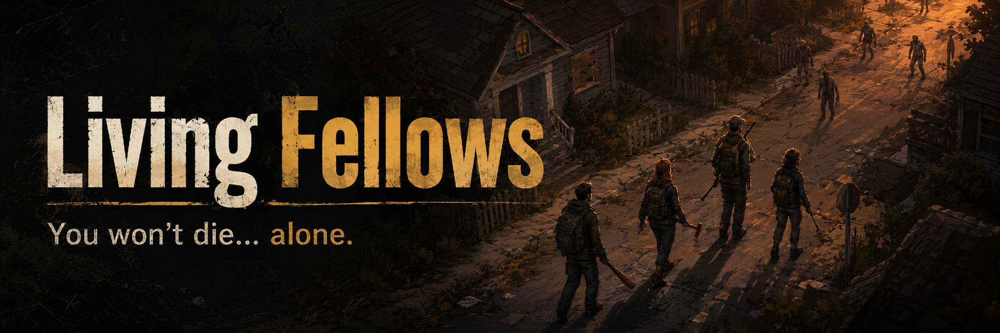
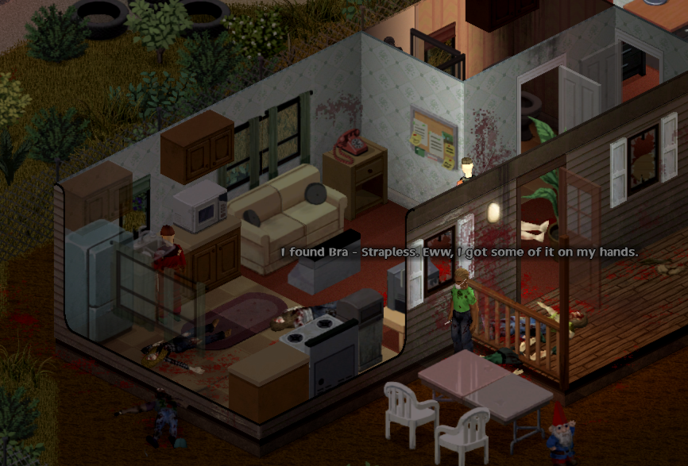

<!-- SPDX-License-Identifier: MIT -->

<p align="center">
  
</p>

# Living Fellows

> ### You won't die... alone.

Persistent companions, survivor households, and living bases for Project Zomboid.

[](LICENSE)
[](#requirements)
[](CHANGELOG.md)
[](#requirements)

Living Fellows turns the survivors you meet into persistent people. They can join you, fight and travel with you, help run a base, and make their own survival decisions. Companions are native human actors with real inventories, injuries, skills, and permanent death.

This is a public playtest release. Back up important saves and include logs when you report a problem.

## Contents

- [Highlights](#highlights)
- [Requirements](#requirements) · [Install (Workshop)](#install-from-steam-workshop) · [Install (standalone)](#install-with-installbat)
- [First five minutes](#first-five-minutes)
- [Companion panel](#companion-panel) · [Orders](#orders)
- [How companions behave](#how-companions-behave)
- [Base life and production](#base-life-and-production)
- [Survivor households and bandits](#survivor-households-and-bandits)
- [Sandbox options](#sandbox-options)
- [Saves and backups](#saves-and-backups) · [Compatibility](#compatibility)
- [Troubleshooting](#troubleshooting) · [Reporting a bug](#reporting-a-bug)
- [Building from source](#building-from-source) · [Repository layout](#repository-layout)
- [Clean-room status and license](#clean-room-status-and-license)

Full change history lives in [CHANGELOG.md](CHANGELOG.md).

## Highlights

- Up to 16 persistent companions with names, professions, traits, personalities, relationships, memories, needs, wounds, equipment, and permanent death.
- Squad movement in formation through doors, windows, fences, stairs, and vehicles, with corner checks, retreat routes, and running escapes.
- Combat that weighs health, stamina, panic, skill, weapons, allies, and escape routes, under a team-wide Rules of Engagement.
- Scavenging, bag management, gear upgrades, eating, drinking, washing, and wound care using the game's own actions.
- A living base with zones, classified storage, roles, watches, chores, repairs, gathering, and production: felling trees, sawing planks, digging graves, collecting and burying the dead, and burning them on a pyre you mark.
- Survivor households that trade, remember how you treat them, and offer contracts, quests, and recruitment, plus rare hostile bandit camps.
- Private diaries: some companions write short entries in a real book about what actually happened to them, including wounds, bites, and the Knox fever. The book stays with them when they die.
- A translucent companion panel, context-menu commands, first-name labels, minimap markers, a base-layout overlay, and a Support page for diagnostics.

## Requirements

Living Fellows targets **Project Zomboid Build 42.20.4** and is **single-player only**. Multiplayer and split-screen are refused so they cannot corrupt a save.

| Method | What you need | Best for |
| --- | --- | --- |
| Steam Workshop | Project Zomboid 42.20.4 and ZombieBuddy 2.3.3 or newer | Automatic Workshop updates |
| `Install.bat` | Windows and Project Zomboid 42.20.4 | Manual or offline installation without ZombieBuddy |

Use only one copy. The Workshop and standalone editions share the mod ID `SurvivorCompanion`.

## Install from Steam Workshop

1. Close Project Zomboid.
2. Subscribe to **ZombieBuddy 2.3.3 or newer** and to **Living Fellows**.
3. Start the game, open **Mods**, and enable both.
4. For an existing save, use **More... > Choose Mods** and enable both mods for that save.
5. Back up the save before your first long session.

## Install with `Install.bat`

The standalone edition does not need ZombieBuddy.

1. Download `LivingFellowsCompanion-<version>-STANDALONE-WINDOWS.zip` from [Releases](https://github.com/thorelvin/living-fellows/releases).
2. Extract the whole ZIP to a normal folder. Do not run it from inside the ZIP viewer.
3. Close Project Zomboid.
4. Double-click **Install.bat**.
5. Start the game and enable **Living Fellows** for your save.

The installer finds Steam automatically. If Windows denies access to the game folder, run it as Administrator. For a different Steam library:

```powershell
.\Install.bat -GameRoot "D:\SteamLibrary\steamapps\common\ProjectZomboid"
```

It installs the mod under `%USERPROFILE%\Zomboid\mods\SurvivorCompanion`, keeps its bridge under `%LOCALAPPDATA%\LivingFellows`, and backs up `ProjectZomboid64.json` before changing it. It never edits `projectzomboid.jar`. Run **Uninstall.bat** from the same folder to remove it and restore the original launcher settings.

## First five minutes

1. Load a single-player save.
2. Press **Home** to open the companion panel, or click the small **LF** launcher when the panel is collapsed.
3. Explore until you meet a survivor. Survivors never join automatically.
4. Select the survivor in the panel and press **Recruit** when it is offered.
5. Open **Orders** and pick a main order. New recruits start on **Follow**, **Copy player** movement, and **Ride with player**.
6. If something looks wrong, open **More → Support** for runtime health and a copyable report.

## Companion panel

The panel is translucent so you can still see the world. It can be docked left or right, collapsed to the **LF** launcher, or toggled with Home (rebindable under Living Fellows in the key bindings).

| Tab | Purpose |
| --- | --- |
| Status | Health and needs, current action, order, distance, relationship summary, and conversation |
| Orders | Direct orders, movement and follow distance, combat doctrine, and work policy |
| Squad | Group assignment, group orders, movement and fire signals |
| Loadout | Wounds and treatment, inventory, weapon and carry policy, and vehicle status |
| More | Base (camp operations), Factions (households, trade, standing), Journal (history, relationships, memories, goals), and Support (runtime health) |

## Orders

- **Main order:** Follow, Stay, or Guard. Guard patrols around its anchor. Inside your camp area, Stay and Guard put the companion on base duty instead; Guard makes it a guard that watches the square you picked. **Regroup** and **Retreat** are immediate emergency actions.
- **Follow distance:** how far behind you the team keeps. When you stop, followers hold formation for a few seconds before they start downtime or scavenging nearby.
- **Movement:** Copy player, walk, sneak, or run. Escapes and combat can override it.
- **Work mode:** useful chores, downtime, or supply crafting when it is safe.
- **Scavenging:** on or off.
- **Weapon priority:** best available, melee, firearms, or quiet weapons.
- **Combat doctrine:** Stealth, Close Defense, Ranged Support, or Weapons Free, for one companion or the whole team.
- **Hold fire:** blocks ordinary shots whatever the doctrine allows.
- **Ride with player:** takes free passenger seats and gets out with you. Extra followers wait safely on foot.
- **Allow overload:** lets a companion carry more than its normal limit, up to a cap.

Right-click the world for the **Living Fellows** menu. The selected companion gets **Move here** plus one action for the clicked object: open or close a door, barricade, remove a barricade, dismantle, or **Check room** for an indoor room. Talk, target actions, care, squad signals, base work, and households sit in submenus. Dismissing a companion asks for confirmation.

## How companions behave

### Movement

Followers keep formation slots instead of stacking on you. Each fireteam puts a close fighter at point, firearm support in the middle, and a cautious survivor at the rear. They file through doors, windows, fences, and stairs, then spread out again. They check blind corners, climb fences and walls with the player's own actions, route around vehicles, furniture, and crowds, and remember the way back outside. When danger closes in they back off or strafe on safe ground, and turn and run when they are overrun.

In clear conditions companions spot zombies up to 24 tiles away. Each companion must see the target for itself: walls, closed doors, and other floors block sight, and noise behind a wall only produces an uncertain warning.

### Combat

Companions fight with the game's own attack animations and weapon timings. They weigh wounds, stamina, panic, pain, morale, skill, weapon condition, support, and escape routes. They split targets, avoid friendly fire, shove when it is safe, finish grounded zombies, and cover a retreat.

Zombies hunt companions like players. Bites can infect and turn them, and a swarm can pin a companion to the ground unless you thin it in time. Combat calls make real noise; under Stealth doctrine companions use silent hand signals when they can.

### Scavenging and equipment

A scavenger picks one container, walks to it, finishes the rummage animation, and moves one verified item. Empty containers are skipped for a while. Scavengers also search containers you have already opened, so a house you searched first is still worth their time. Inside your base it works the other way round: companions use the storage you have marked, of any category, for scavenging and for meals, down to any reserve you set, and leave every unmarked container to you. Memorial storage keeps its keepsakes. Companions use backpacks, keep supplies suited to their role, drop dead weight outside combat, loot dead zombies when it is safe, upgrade clothing and armor, and wash themselves and their gear near clean water.

<p align="center">
  
</p>

<p align="center"><em>A scavenger reports what it pulled off a body, in its own voice.</em></p>

Now and then, when a spot has been quiet for a while, a companion crouches over a dead zombie nearby and talks through what it sees: the clothes, what the infection did to the person, and what Knox Knews and the radio said back in July 1993. Every companion does it in its own voice, which might be a quiet word, a civil-defense joke, or something about Kentucky. Doctors, nurses, police, and other hands-on professions are more curious. Cautious companions keep their distance, and a badly stressed one never looks. Each body gets one look.

Sometimes a companion stops at a body for a different reason. It crouches and says a few quiet words, and if the dead carried a keepsake such as a photo or a locket, it mentions it and leaves it where it lies. Caring companions do this most, and more often right after a fight. A friend nearby may say something back.

### Needs, medicine, and death

By default hunger and thirst rise at half the player rate. Companions eat, drink, use clean water, fetch from camp storage, tear cloth into bandages (or use a dirty rag when nothing clean is left), treat themselves, and help an injured player when it is safe. Death is permanent and follows the game's own corpse and reanimation rules. A known bite can lead to concealment, confession, quarantine, exile, or a farewell; lethal decisions always need your confirmation. Those who learn of it walk over and talk it through face to face. A bitten companion may first confide in the one it trusts most, which might be you, and a protective friend might keep the secret for a while.

### Personality and relationships

Every survivor has a profession, trait, personality, history, keepsake, preferred camp role, and personal goal. Trust, bonds, morale, stress, memories, grief, and relationships persist, and dialogue reacts to what actually happened. Stress can show as venting, pacing, arguments, withdrawal, or a breakdown; good morale gives small boosts. Danger interrupts all of it.

Companions also talk in their own voice. A surrounded companion may yell a deadpan fake distraction at the zombies, one of them cracks a joke when you stand still for a few minutes, and the first walk into a notable place, such as a police station, church, bar, hospital, or gun store, earns a remark. Former police officers, doctors, nurses, and other professions have lines of their own for places like their old workplaces. It is all speech, spaced out so it never piles up, and it never changes what anyone does.

Companions also remember their best fights. Four kills in one fight, or a kill after being pulled down, becomes a story. The companion tells it later, when things are calm at the base or you have stood still for a minute. Every retelling grows the numbers and the title, from "that thing at the gas station" to "the Legend of the Gas Station". A companion who was there may correct it, but the teller never backs down.

Companions have body language too. They yawn late at night, and the yawn spreads to whoever stands nearby. They stretch after sitting and first thing in the morning at base, and sneeze in dusty storerooms or cough in the cold. Athletic companions do a short workout at base in the morning, and others sometimes join them. It is all animation, with no sound and no effect on stats.

### Private diaries

Some companions keep a diary. When a companion joins, the game decides once whether they are a diary keeper (about one in three by default) and saves that choice. A diary keeper carries a book named after them, plus a pencil if they had nothing to write with. Now and then, in a quiet safe moment, they open the book for a few seconds and write a short entry. They write at most once a day, usually every day or two.

Every entry is about something that really happened to that companion: joining you, a scratch, cut, burn, fracture or bite on their own body, being bandaged by you or by someone else, getting out of danger with you, a friend's death they grieve, and the Knox virus. That means a bite they are hiding or have confessed, a fever that gets worse, the group's decision about them, or learning that someone else was bitten. A companion only writes what they could know. A hidden infection stays out of the book until they feel the fever, and help is credited only to whoever actually gave it. They also write about everyday life, the funny and the grim. That includes the first time the party walks into a police station or a Spiffo's, a zombie they studied in a Santa suit, and a fight story whose number keeps growing each time they tell it (the diary keeps the real count). It includes praise and pep talks, workouts and repairs, planks sawn, a week together, and quiet days shaped by the rain, the season, hunger or a cold. On the darker side: watching a friend get hurt, arguments and breakdowns, burying strangers, burning bodies, burying a friend by name, and carrying out a mercy decision. Each keeper has their own voice (plain and guarded, warm, blunt, or wry and watchful), and a later entry may quote an earlier page when their view of you has really changed. If an entry is interrupted, nothing is written.

A page is never rewritten, and nothing is written after the author dies. The book stays with them, on the body, in a bag or wherever they left it. Right-click the book and choose **Read** to open it. Reading a living companion's diary asks you to confirm first, since it is private. Reading gives no experience or other reward. A book holds 60 entries. Diaries can be turned off, and the keeper chance changed, on the sandbox page.

## Base life and production

**Setting up a camp.** Right-click the ground and choose **Living Fellows → Base life → Set camp core here**. Draw zones with **Start zone here** and **Finish zone here**, and use **Mark storage as...** on containers. Companions help themselves from marked storage and leave unmarked containers in the camp to you. Assign residents, roles, and policies in **More → Base**. **Show base layout** draws zones and storage on the ground.

Zones include the camp boundary, work area, lumber area, burial ground, pyre, rest, social, guard, rally, and quarantine areas. Every zone lies inside the camp except lumber areas, burial grounds, and pyres, which may also lie up to 30 tiles beyond the camp boundary. A pyre is at most nine tiles and must pass a fire-safety check when you draw it.

Residents on base duty sort storage, repair gear, craft supplies, keep watch, patrol, maintain barricades, and build queued construction. Immediate danger always interrupts base work. Giving Stay or Guard inside the camp area also puts a companion on base duty. A guard on shift keeps watch around its post instead of taking general chores.

To see the base layout, press End (rebindable under Options, Key bindings, Living Fellows), use right-click, Living Fellows, Base life, or use the button in the Base tab. Each zone gets a see-through floor tint and outline in its colour, registered storage gets a tile and outline in its category colour, and a legend lists what is on screen.

**Gathering.** One or two residents carry a set number of loose logs or planks from a work area or lumber area into one storage container. They walk to each item, pick it up, and deposit that exact item; nothing is created from thin air.

**Production.** The **Production** section of the Base view gives one or two residents a finite order. Tools and materials come from camp storage.

| Job | You need | What happens |
| --- | --- | --- |
| Fell trees | A lumber area and an axe in storage | Residents chop standing trees with the game's own action. A tree counts only once it is down, and its logs can be hauled to storage automatically across as many bounded hauling batches as needed. |
| Saw planks | Logs in one storage, a saw, and a second storage for planks | Residents take one log at a time, saw it into three planks with the vanilla recipe, and store the planks. Completed output is recovered after a pause or reload before another log can be taken. |
| Dig graves | A burial ground and a shovel | Residents dig vanilla graves on natural ground. |
| Bury the dead | A burial ground and a shovel | Residents match each body to a usable open grave, reserve both while working, and dig near an eligible body if needed. They fill the grave when it is full or the order is done, and can add a wooden cross (hammer, two planks, two nails). |
| Collect the dead (experimental) | A burial ground and a shovel, or a pyre with a lighter and a petrol can | Residents find bodies in the camp and lumber areas, take hold of one at a time with the game's own corpse grapple, drag it to the chosen burial ground or pyre, and bury or burn it there. The chosen area decides the method. |
| Burn the dead (experimental) | A pyre, a lighter, and a petrol can | Residents light each body already on the pyre with the game's own action, one fire at a time, and watch from a distance until it is out. |

- Chopping is loud. No tree is started while danger is visible nearby, winded residents rest, and a chop that gets stuck is abandoned after three minutes.
- Outside the camp boundary, residents start no new tree and fetch no body at night (21:00–06:00).
- Bodies still carrying items are left for you to loot unless the order handles them with their belongings.
- A resident dragging a body takes no fences, windows, or stairs, and drops it at once when danger shows up. The body stays where it fell.
- Fire is real. A pyre must be outdoors on open ground, away from buildings, stored goods, trees, vehicles, and loose items. Nothing is lit in the rain unless you allow it, nobody else may stand close to the body being lit, and if fire appears beyond the pyre every worker stops and the order waits for your Retry.
- A fallen companion found by Collect the dead gets an empty grave of their own and always a cross, and the grave keeps their name. Fallen companions are never burned. A body whose identity is not certain is treated as a stranger, and your own body is never touched.
- A blocked order shows the reason and tries again on its own; a spreading fire waits for Retry.

Every closed grave gets a few words: a short prayer or a line of bleak gallows humor depending on who holds the shovel, a salute, and sometimes an "Amen" from a friend nearby. Lighting a pyre may earn a "Burn, baby, burn!" or "Disco inferno!", a burned-out pyre gets its own prayer or gallows line, and a fallen companion's grave closes with their name instead of a joke.

## Survivor households and bandits

Households of one to three survivors occupy real houses, barricade them, warn strangers, and defend their territory. They remember theft, damage, help, and murder. A household can trade when it has a real shortage, share imperfect rumors, offer contracts and quests, grant temporary access, and eventually let one resident try out as your companion. What you learn appears in **More → Factions**, and quest targets are marked on the world map.

Bandit camps are rare, always hostile, and appear from day four. Bandits guard and patrol their camp, need line of sight to target you, and fight zombies too. They never trade or recruit.

## Sandbox options

The **Living Fellows** sandbox page controls:

| Option | Effect |
| --- | --- |
| Spawn independent survivors, frequency | Whether and how often new survivors appear |
| Maximum active companions | Limit for new recruits and encounters (up to 16) |
| Companion hunger and thirst rate | 0 disables, 0.5 is the default, 1 matches the player |
| Spawn new survivor households, daily chance, maximum | Household spawning |
| Spawn bandit camps, daily chance, maximum | Bandit camp spawning |
| Companion menu opacity | Panel background opacity |
| Show companion first names | Name labels above companions you can see |
| Companions keep private diaries, diary keeper chance | Whether some companions write diaries, and the chance (35% by default), decided once per companion |

Lowering a limit never deletes companions, households, or camps already in the save. Turning diaries off never removes a book or its pages.

## Saves and backups

Companions, households, relationships, contracts, bases, and production orders are saved with the world, so they survive the death of your character.

Before installing or updating:

1. Close the game.
2. Copy your save folder from `%USERPROFILE%\Zomboid\Saves` somewhere safe.
3. Keep at least one backup from before your first Living Fellows session.

Do not remove the mod from an important save without a backup.

## Compatibility

- Supported game version: **42.20.4**.
- Single-player only; multiplayer and split-screen are refused.
- The Workshop edition requires **ZombieBuddy 2.3.3 or newer**.
- The standalone edition is Windows-only and uses its bundled bridge.
- Mods that replace player actor construction, animation ownership, pathfinding, vehicle passenger state, UI key bindings, or the same launcher `mainClass` may conflict.
- The default panel key is **Home**. Rebind it or report a conflict if another mod uses it.
- No Project Zomboid game file is redistributed or patched in place.

## Troubleshooting

### The panel is missing

Press Home once, then look for the small **LF** launcher at the edge of the screen. Confirm Living Fellows is enabled for the current save. Workshop users must also have ZombieBuddy enabled and current. Standalone users should rerun `Install.bat` after a game update and check **More → Support**.

### A companion is only a moving shadow

The native actor bridge did not load or failed its health check. Open **More → Support** and copy its report. Do not continue a valuable save until companions render correctly.

### A companion is stuck

Wait a moment for automatic recovery, then use **Regroup**. If it stays stuck, note what is in the way (door, gate, fence, vehicle, stairs, or furniture) and the current order and movement setting, and send the Support report, logs, and a screenshot or short video.

### Workshop and standalone copies conflict

Remove one copy. Keep only one `SurvivorCompanion` mod folder, restart the game, and enable the remaining copy for the save.

### Standalone uninstall cannot restore the launcher

Close Project Zomboid and rerun `Uninstall.bat` from the same release folder. Its backup lives under `%LOCALAPPDATA%\LivingFellows`; do not delete that folder until the uninstall succeeds.

## Reporting a bug

Use the repository's [bug report form](https://github.com/thorelvin/living-fellows/issues/new/choose). Include:

- Living Fellows version and installation method;
- exact Project Zomboid version;
- new or existing save;
- other enabled mods;
- what you expected and what happened;
- steps to reproduce, if known;
- screenshots or a short video for visual or pathing problems; and
- the relevant logs.

Windows log locations:

```text
%USERPROFILE%\Zomboid\console.txt
%USERPROFILE%\Zomboid\logs.zip
```

Remove server addresses, usernames, chat, and other personal information before posting logs publicly.

## Building from source

Building requires Project Zomboid 42.20.4 installed locally (the Java bridge compiles against the game's classes), a Java 17+ JDK, and Python 3.12+. The repository includes the versioned bridge JAR, so a source archive can also use `Install.bat` directly.

Run the complete test gate:

```powershell
powershell -NoProfile -ExecutionPolicy Bypass -File .\scripts\Test-Project.ps1
```

Build the Workshop upload package or the standalone Windows package:

```powershell
powershell -NoProfile -ExecutionPolicy Bypass -File .\scripts\Build-Workshop.ps1
powershell -NoProfile -ExecutionPolicy Bypass -File .\scripts\Build-Standalone.ps1
```

The standalone builder installs and uninstalls the package against an isolated fake game folder and writes a ZIP plus SHA-256 checksum under `build\release`.

Maintainers can run the real-engine sandbox tests with the game closed. They work on a cloned save and never touch a normal save in place:

```powershell
powershell -NoProfile -ExecutionPolicy Bypass -File .\scripts\Invoke-LiveSandboxTests.ps1
```

## Repository layout

| Path | Contents |
| --- | --- |
| `SurvivorCompanion/` | The mod payload |
| `bridge/` | Java bridge source for the native companion actor |
| `scripts/` | Build, install, uninstall, packaging, and test automation |
| `tests/` | Lua, Java, PowerShell, static, UI, and sandbox tests |
| `assets/` | Project artwork and release images |
| `Workshop/` | Steam Workshop metadata and upload staging |
| `docs/` | Architecture, provider, safety, and subsystem notes |

Read [ARCHITECTURE.md](ARCHITECTURE.md) and [CONTRIBUTING.md](CONTRIBUTING.md) before changing actor ownership, native actions, persistence, or player-state isolation.

## Clean-room status and license

Living Fellows is an original clean-room implementation. It contains no code from the earlier inspiration mod, no copied third-party Lua, no decompiled Project Zomboid source, and no proprietary game assets. Project Zomboid belongs to The Indie Stone; this unofficial mod is not affiliated with or endorsed by The Indie Stone.

Living Fellows source and original project assets are released under the [MIT License](LICENSE).
