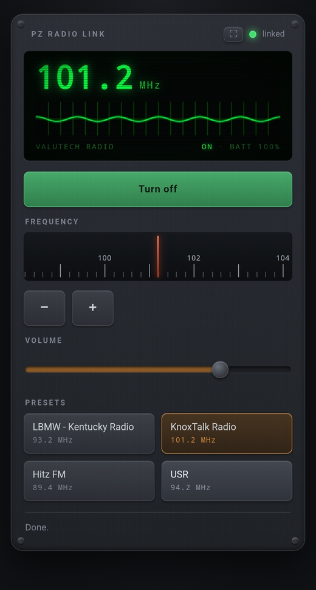
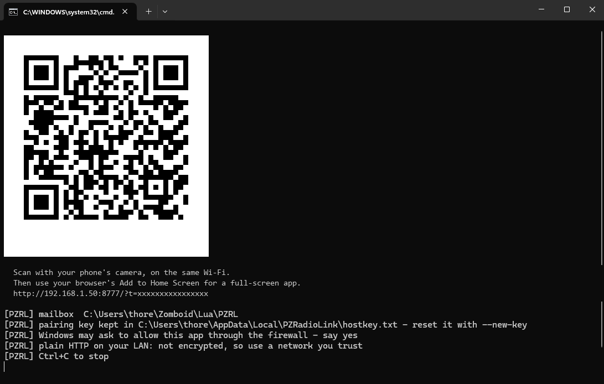

# PZ Radio Link

Control a radio in Project Zomboid from your phone.



Pick up a walkie-talkie in game, right-click it, choose **Link to phone**, and
you get the faceplate above on your phone over Wi-Fi. Power, tuning, volume and
presets — while your survivor keeps doing something else.

**Version 0.2.1** — for **Project Zomboid build 42.20.4**, single-player. No audio;
see [Limits](#limits).

---

## What you need

- Project Zomboid on Windows
- **Python 3.9 or newer** on your PATH — nothing to `pip install`
- A phone on the **same Wi-Fi** as the PC

---

## Setup

### 1. Install the mod

```powershell
powershell -ExecutionPolicy Bypass -File .\Install-Mod.ps1
```

This copies the mod into your Zomboid `mods` folder. It does not touch the game
folder or patch anything.

### 2. Start the host

Double-click **`Start-Host.bat`** and leave the window open. You get this:



The first time, Windows asks to allow it through the firewall — **say yes**, or
your phone cannot reach it.

### 3. Enable the mod in game

Launch Project Zomboid, then:

- **New save:** enable *PZ Radio Link* on the Mods screen.
- **Existing save:** load the save, then enable it from **that save's** mod
  list. The global Mods screen only affects new games — this catches people out.

### 4. Scan the QR

Point your phone camera at the QR in the console window. It opens the faceplate.

Optional: use your browser's **Add to Home Screen** to get a proper full-screen
app with an icon.

### 5. Link a radio

In game, **right-click a radio in your inventory → Link to phone**.

The page goes from *no radio linked* to live. That's it.

---

## Using it

| Control | What it does |
|---|---|
| **Power** | Turns the radio on or off. Refused if the game refuses it — no battery, no power. |
| **Frequency** | Drag the dial, or tap **−** / **+** for single steps of 0.2 MHz. |
| **Volume** | Drag and release. |
| **Presets** | Tap one to tune to it. The current station is outlined in orange. |

Changes you make in the in-game radio window show up on the phone, and the other
way around. The phone says **Done.** only once the game has actually applied the
change — not just because the button was pressed.

### Placed radios

Radios on the ground or on furniture work too — right-click one in the world and
choose **Link to phone**.

You have to be **standing next to it** to change anything. The in-game window
reaches a distant radio by walking your survivor over to it, and a button on a
phone should never do that while you are not watching the screen. So it says
*too far* instead. Walking away does not unlink it — walk back and it works again.

---

## If something goes wrong

| What you see | What it means |
|---|---|
| **"game not running"** | The game is closed, at the main menu, or the mod is not enabled **for that save**. See step 3. |
| **"no radio linked"** | The mod is running fine. Right-click a radio in game and pick *Link to phone*. |
| **"not paired"** | This phone has no valid key. Scan the QR again, or type the key into the box the page shows. |
| **"out of reach"** | A placed radio you have walked away from. Go stand next to it. |
| **"too far"** on a command | Same thing. Nothing was changed. |
| **"paused"** | The game is paused. Commands wait rather than queue up. |
| Phone cannot load the page at all | Firewall prompt was dismissed, or the phone is on a different network — guest Wi-Fi is usually isolated from the main one. |
| Page works on the PC but not the phone | Almost always the firewall or the wrong Wi-Fi network. |
| Controls grey out when you alt-tab | Single-player pauses on focus loss. Set **Options → Pause on Focus Loss → No**. Not an issue when you use a phone. |
| Nothing happens and the console shows errors | Check `%USERPROFILE%\Zomboid\Lua\PZRL\` — if it is empty, the mod is not running. |

The radio always keeps working normally in game, whether or not the host is
running. Turning all of this off changes nothing about your save.

---

## Good to know

**Security.** The QR contains a key your phone needs. It stops other devices on
your network from grabbing your radio. It is **not encryption** — this is plain
HTTP on your LAN, so use it on a network you trust, not café Wi-Fi.

The key is stored at `%LOCALAPPDATA%\PZRadioLink\hostkey.txt` and does not
change between restarts, so a home-screen shortcut keeps working. To reset it
and unpair every device:

```powershell
Start-Host.bat --new-key
```

If the page ever says **"not paired"** — a fresh phone, cleared storage, or a
rotated key — type the key into the box it shows. It is printed under the QR
code in the host window.

> **Upgrading from 0.2 or earlier:** those builds published the pairing key in
> the web app manifest, so any device that could reach the host could read it
> without scanning the QR. Keys from those versions are **retired automatically**
> the first time 0.2.1 starts, and new keys are 128-bit. You will need to
> re-scan the QR once.

**Sharing screenshots.** A picture of the host console contains a working key,
in the QR *and* in the text under it. Run it through the redactor before posting:

```powershell
python tools\redact_console_shot.py <capture.png> docs\host-console.png
```

**Your screen will sleep.** Keeping a phone display awake needs HTTPS, which
this does not use.

---

## Limits

Deliberately not included: audio, transmitting, the microphone, preset editing,
media playback, and vehicle radios. Multiplayer and split-screen are refused
outright.

**Why no audio?** Getting *just this radio's* sound out of the game is not
possible with what the game exposes. Captions are not possible either: the
event that carries radio text says where the sound came from, but not which
radio received it — and for a radio in your pocket that position is simply your
own. Rather than ship something that guesses which radio you meant, it is left
out. The evidence is under *Deliberately absent* in [`NOTES.md`](NOTES.md).

Tuning is slightly *more* than vanilla allows: the in-game window can only tune
to a saved preset, whereas the phone tunes directly to any 0.2 MHz step in the
radio's range — the same frequencies you could reach by saving a preset first.
It never creates or deletes presets to do it, because that list is your save data.

---

## Uninstall

```powershell
powershell -ExecutionPolicy Bypass -File .\Install-Mod.ps1 -Uninstall
```

Removes the mod folder. Saves, settings and other mods are untouched.

---

## For developers

Two processes, because the game's Lua VM has no sockets: a stdlib-only Python
host serves the page, and the mod talks to it through framed files in
`Zomboid\Lua\PZRL`. The game stays authoritative — nothing here simulates power,
battery, channel or reception.

```
browser --HTTP--> pzrl_host.py --files--> Zomboid\Lua\PZRL <--files-- Lua mod --> the radio
```

Run everything:

```powershell
powershell -ExecutionPolicy Bypass -File .\scripts\Test.ps1
```

Five gates: the mod's Lua compiles in the game's own Kahlua VM; a harness inside
that VM checks the codec matches the Python host byte for byte; the host is
driven end to end over a real mailbox; the page is structurally checked; and the
from-scratch QR encoder is verified against `segno` as a development-time oracle.

**[`NOTES.md`](NOTES.md)** has the engine evidence behind every API this relies
on, and — importantly — the list of paths that have **not** been tested against
a running game.

```
host/pzrl_host.py     HTTP server and mailbox
host/pzrl_qr.py       QR encoder
host/pzrl_icon.py     app icon
host/web/index.html   the faceplate
mod/PZRadioLink/      the Lua mod, as installed
tests/                the five gates
tools/                the screenshot redactor
```
