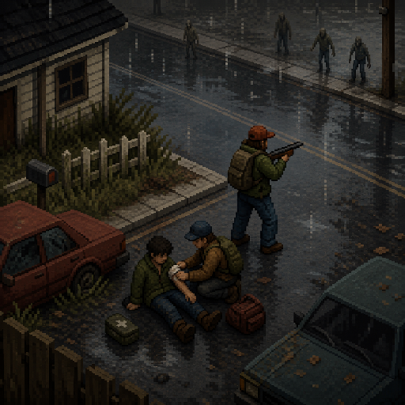

<!-- SPDX-License-Identifier: MIT -->

<p align="center">
  
</p>

# Living Fellows

> ### You won't die... alone.

Persistent companions, survivor households, and living bases for Project Zomboid.

[](LICENSE)
[](#requirements)
[](CHANGELOG.md)
[](#requirements)

Living Fellows turns isolated survivors into persistent people who can become teammates, establish routines, help run a base, and make their own survival decisions. Companions use native human actors, keep real inventories and injuries, and can follow, fight, retreat, scavenge, work, travel, grieve, argue, and remember what happened to them.

This is a public playtest release. Back up important saves, expect balance and compatibility work, and include logs when reporting a problem.

## Contents

- [Highlights](#highlights)
- [Requirements](#requirements) · [Install (Workshop)](#install-from-steam-workshop) · [Install (standalone)](#install-with-installbat)
- [First five minutes](#first-five-minutes)
- [Companion panel](#companion-panel) · [Orders and policies](#orders-and-policies)
- [How companions behave](#how-companions-behave)
- [Survivor households and factions](#survivor-households-and-factions)
- [Saves, updates, and backups](#saves-updates-and-backups) · [Compatibility](#compatibility)
- [Troubleshooting](#troubleshooting) · [Reporting a bug](#reporting-a-bug)
- [Building from source](#building-and-testing-from-source) · [Repository layout](#repository-layout)
- [Clean-room status and license](#clean-room-status-and-license)

New to Living Fellows? Jump to **[First five minutes](#first-five-minutes)**. Full change history lives in [CHANGELOG.md](CHANGELOG.md).

## Highlights

- Persistent companions with names, professions, traits, personalities, relationships, memories, needs, wounds, equipment, and permanent death.
- Tactical movement with formations, corner checks, rear awareness, choke-point reservations, obstacle recovery, retreat routes, strafing, and player-mirroring movement.
- Situational combat decisions based on health, endurance, panic, pain, skill, weapons, allies, nearby threats, footing, and escape quality.
- Scavenging, nested bag management, armor and weapon upgrades, washing, eating, drinking, bandaging, supply crafting, and role-aware carry limits.
- Follow, stay, guard, patrol, regroup, retreat, work, vehicle, weapon, combat, stealth, and Rules of Engagement policies.
- Living-base routines, camp storage, readiness, watches, chores, repair, crafting, downtime, boredom, stress responses, conflict, and morale boosts.
- Survivor households that barricade homes, warn strangers, defend territory, expose shortages, trade conditionally, remember player conduct, and offer social contracts.
- Debug and profiling tools in development builds, with fail-closed runtime health checks in public builds.
- A translucent companion panel, compact collapsed launcher, context commands, Support diagnostics, and recruited-teammate minimap markers.

## Requirements

Living Fellows currently targets **Project Zomboid Build 42.20.4**, is **single-player only**, and supports Windows for the standalone installer.

Choose one installation method:

| Method | What you need | Best for |
| --- | --- | --- |
| Steam Workshop | Project Zomboid 42.20.4 and ZombieBuddy 2.3.3 or newer | Normal Workshop updates |
| `Install.bat` | Windows and Project Zomboid 42.20.4 | Manual/offline installation without ZombieBuddy |

Do not enable a Workshop copy and a standalone copy together. They intentionally share the mod ID `SurvivorCompanion`, so the game should load only one copy.

Multiplayer and split-screen are not supported. The runtime refuses to create companions there instead of risking save or player-state corruption.

## Install from Steam Workshop

1. Close Project Zomboid.
2. Subscribe to **ZombieBuddy 2.3.3 or newer**.
3. Subscribe to **Living Fellows**.
4. Start Project Zomboid and open **Mods**.
5. Enable ZombieBuddy and Living Fellows.
6. When loading an existing save, use **More... > Choose Mods** and enable both mods for that save.
7. Back up the save before the first long playtest.

The Workshop listing will be linked here when its public page is published. The repository's release archive also contains a Workshop-ready upload package for maintainers and testers.

## Install with `Install.bat`

The standalone release does not require ZombieBuddy.

1. Download `LivingFellowsCompanion-<version>-STANDALONE-WINDOWS.zip` from [Releases](https://github.com/thorelvin/living-fellows/releases).
2. Extract the entire ZIP to a normal folder. Do not run it from inside the ZIP viewer.
3. Close Project Zomboid completely.
4. Double-click **Install.bat**.
5. Start the game, enable **Living Fellows**, and enable it for the save you want to test.

The installer normally finds Steam and the game's mod folder automatically. If Windows denies access to the Steam game directory, run `Install.bat` as Administrator. The installer never edits `projectzomboid.jar`.

For a non-standard Steam library, open PowerShell in the extracted folder and provide the game path:

```powershell
.\Install.bat -GameRoot "D:\SteamLibrary\steamapps\common\ProjectZomboid"
```

The standalone installer:

- installs the mod under `%USERPROFILE%\Zomboid\mods\SurvivorCompanion`;
- stores its owned bridge under `%LOCALAPPDATA%\LivingFellows`;
- backs up `ProjectZomboid64.json` before adding the external bridge JAR to the classpath;
- records ownership manifests so it will not remove unrelated files; and
- restores the original launcher configuration when **Uninstall.bat** is run.

To remove the standalone edition, close the game and run **Uninstall.bat** from the same extracted release. Keep the release folder until you are finished testing.

## First five minutes

1. Load a single-player save in Build 42.20.4.
2. Press **F7** to cycle the companion panel, or use the small **LF** launcher when the panel is collapsed.
3. Explore until you meet a neutral survivor. A neutral survivor does not join automatically.
4. Select the survivor in the panel and use the prominent **Recruit** action when it is available.
5. Open **Orders** and choose a main order. New recruits default to **Follow**, **Copy player** movement, and **Ride with player**.
6. If actors are missing, a button fails, or the panel behaves unexpectedly, open **More → Support** for runtime health and a copyable diagnostic report.

Public builds do not automatically spawn a test companion every minute. Manual spawning and destructive state controls are available only in the debug build.

## Companion panel

The panel is translucent so the world remains visible while commands are open. It can be docked left or right, collapsed to a compact launcher, or cycled with F7.

The everyday controls live on five primary tabs. Deeper views open from the **More** tab so the common actions stay uncluttered.

| Tab | Purpose |
| --- | --- |
| Status | Health, needs, current intent, order, distance, relationship, mood, profession, carry state, and recent verified work |
| Orders | Main order, follow distance, movement, work, scavenging, combat, weapon, vehicle, overload, group, regroup, and retreat controls |
| Loadout | Inventory, equipped items, carrying policy and weapon preference, and clothing/vehicle status — plus wounds, treatment, infection symptoms, medicine, hunger, and thirst |
| Base | Camp roles, storage, watches, readiness, maintenance, work queues, and ambient routines |
| More | Opens Groups (squad orders), Factions (households, trade, standing), Journal (history, personality, relationships, memories, grief, keepsakes), Support (runtime/bridge health and diagnostics), and — in development builds — Debug |

Buttons show a confirmation message when an order is accepted. Selectors and checkboxes display the persistent policy that will be used after saving and reloading.

## Orders and policies

- **Main order:** Follow, stay, guard, patrol, or another contextual task. Regroup and Retreat remain immediate emergency actions.
- **Follow distance:** Controls the desired formation distance without forcing companions into one exact tile.
- **Movement:** Copy player, walk, sneak, or run. Copy player mirrors ordinary crouch, walk, and run behavior. Escape and immediate combat may override it for survival.
- **Work mode:** Useful chores, downtime, or supply crafting when conditions are safe.
- **Scavenging:** One persistent checkbox. A companion completes the rummage animation before committing a verified transfer.
- **Combat stance:** Passive, defensive, or aggressive.
- **Weapon priority:** Best available, melee, firearms, or quiet weapons.
- **Rules of Engagement:** Stealth, Close Defense, Ranged Support, or Weapons Free for the selected team.
- **Hold fire:** Prevents ordinary shots even when the current doctrine would permit them.
- **Ride with player:** Uses available passenger seats, follows the player into a vehicle, exits with the player, and leaves excess companions safely on foot.
- **Allow overload:** Lets the selected companion exceed its normal mobility-first carry policy within a bounded limit.

World context commands are grouped under **Talk**, **Orders**, **Target actions**, and **Companion**. Only recruited teammates appear in the Companion commands list. Contextual target actions can open or close doors, check rooms, remove barricades, dismantle eligible objects, and assign movement or base work.

## How companions behave

### Movement and awareness

Followers use formation slots instead of stacking on the player. They check blind corners and room thresholds, occasionally look behind, space themselves through doors and stairs, remember a recent route back outdoors, and replan around vehicles, furniture, crowds, vegetation, windows, gates, slopes, and player-built obstacles. Bushes and trees are costly terrain rather than universal walls, so an emergency route may still cross vegetation.

Companions can backpedal or strafe while disengaging on safe ground. A true overrun, grab threat, blind turn, narrow transition, or poor footing makes them turn and run. Escape always outranks ordinary walking, crouching, formation, work, and animation preferences.

### Combat

Combat decisions use the companion's real body condition, endurance reserve, panic, pain, tiredness, stress, morale, encumbrance, skills, weapon quality, support, threat directions, footing, and available exits. Allies try to split targets, avoid friendly fire, preserve stamina, shove when a lane is safe, finish isolated grounded zombies, kite, cover a retreat, or disengage before they are surrounded.

Companion attacks land real damage, and companions are real targets in return: zombies notice, chase, and attack them, and a landed hit inflicts an actual wound. Bites can infect and eventually turn a companion, while scratches and lacerations wound and bleed without infecting — so a swarmed or careless companion is in genuine danger and can be lost. Hostile survivors are damaged the same way. When too many zombies pile on at once they can pull a companion to the ground and pin it — thin the swarm in time and you drag your friend back to their feet, bloodied but alive; leave them and the pack finishes the job.

Combat barks report threat scale, engagement, prolonged effort, kills, and emergency withdrawal. They draw from varied English line pools and use actor, team, and intent cooldowns. Spoken yells create real sound and can attract zombies; quiet doctrine prefers silent hand signals when danger permits.

### Scavenging and equipment

A scavenger reserves one source and one item, approaches a safe interaction point, settles, completes the player rummage animation, transfers the exact item, verifies the destination, and only then resumes movement. Failed or unchanged containers receive a cooldown instead of being searched every second.

Companions understand nested bags and prefer suitable worn backpacks. They keep role-relevant food, water, medicine, tools, weapons, ammunition, clothing, and building materials; deposit or drop unnecessary weight outside combat; freely loot useful items from dead zombies when safe; evaluate armor and clothing upgrades; and can wash themselves and dirty equipment near clean water.

### Needs, medicine, and death

Hunger and thirst advance at half the vanilla rate. Companions can eat, drink, seek clean sinks or wells, fetch from player-accessible camp storage, tear cloth into emergency bandages, treat themselves, and help an injured player when doing so does not become suicidal.

Companions are vulnerable to wounds and Knox infection. Death is permanent and is left to the game's native corpse and reanimation systems. A known bite can create concealment, confession, quarantine, exile, mercy, or farewell conflicts based on personality and relationships. Lethal group decisions require explicit player authorization.

### Personality, relationships, and base life

Each survivor receives a deterministic profession, trait, personality profile, history, keepsake, camp role, and personal objective. Trust, bond, shared time, care, morale, stress, memories, grief, and pairwise relationships persist. Dialogue uses real context and varied line pools instead of one repeated response.

Safe companions can read, sit, wash, maintain gear, craft supplies, sort storage, repair, keep watch, patrol, or ask about the next supply run. Prolonged stress can produce venting, pacing, arguments, withdrawal, furniture strikes, thrown empty bottles, or depressive shutdown. Positive momentum can also improve behavior. Immediate danger interrupts every ambient activity.

## Survivor households and factions

The first faction archetype is a household of one to three survivors occupying a suitable house. They carry appropriate supplies, barricade secondary doors and windows while preserving an entrance, and remain separate from the companion roster.

Residents warn unknown players, defend their territory, react to trespass, theft, damage, and murder, and remember what happened. A household can expose a genuine shortage, offer conditional barter, pass imperfect rumors, negotiate a social contract, grant temporary access, or eventually consider one nonessential resident for a recruitment trial. Discovered groups, needs, standing, relations, news, promises, rumors, and access appear in the Factions view, opened from the **More** tab.

## Saves, updates, and backups

Living Fellows writes versioned state into the Project Zomboid save. Current records use transactional schema 2 for recursive inventories, nested bags, worn and attached equipment, weapon parts, fluid state, companions, households, relationships, contracts, bases, and bounded memories.

Before installing or updating:

1. Close the game.
2. Copy the relevant folder from `%USERPROFILE%\Zomboid\Saves` to a safe location.
3. Keep at least one backup from before the first Living Fellows load.

Lowering a sandbox limit does not delete existing companions or households. Do not remove the mod from an important save without first making a backup.

## Compatibility

- Exact supported game version: **42.20.4**.
- Single-player only; multiplayer and split-screen fail closed.
- Workshop installation requires **ZombieBuddy 2.3.3 or newer**.
- Standalone installation is Windows-only and uses the bundled bridge.
- Mods that replace player actor construction, animation ownership, pathfinding, vehicle passenger state, UI key bindings, or the same launcher `mainClass` may conflict.
- The default panel key is **F7**. Rebind or report a conflict if another mod claims it.
- No Project Zomboid game file is redistributed or patched in place.

## Troubleshooting

### The panel is missing

Press F7 once, then look for the small LF launcher near the edge of the screen. Confirm Living Fellows is enabled for the current save. Workshop users must also confirm ZombieBuddy is enabled and current. Standalone users should rerun `Install.bat` after a game update and inspect **More → Support** after launch.

### A companion is only a moving shadow

This normally means the native actor bridge did not load or failed its health check. Open **More → Support** and copy its report. Do not continue a valuable save until the actor is rendering correctly.

### A companion is stuck or moonwalking

Wait briefly for bounded recovery, then issue Regroup. If the actor remains stuck, record the nearby object, current order, movement policy, animation, and exact reproduction steps. Include logs and a screenshot.

### Workshop and standalone copies conflict

Disable and remove one copy. Keep only one folder using the `SurvivorCompanion` mod ID, restart the game, and enable the remaining copy for the save.

### Standalone uninstall cannot restore the launcher

Close Project Zomboid and rerun `Uninstall.bat` from the same release folder. The owned backup and manifests live under `%LOCALAPPDATA%\LivingFellows`. Do not delete that folder until rollback succeeds.

## Reporting a bug

Use the repository's [bug report form](https://github.com/thorelvin/living-fellows/issues/new/choose). Include:

- Living Fellows version and installation method;
- exact Project Zomboid version;
- new or existing save;
- other enabled mods;
- what you expected and what occurred;
- repeatable steps, if known;
- screenshots or a short video for visual/pathing problems; and
- the relevant logs.

Useful Windows log locations:

```text
%USERPROFILE%\Zomboid\console.txt
%USERPROFILE%\Zomboid\logs.zip
```

Remove private server addresses, usernames, chat, or other personal information before uploading logs publicly.

## Building and testing from source

The repository includes the versioned bridge JAR so a downloaded source archive can use `Install.bat`. A normal contributor build requires Project Zomboid 42.20.4 installed locally because the Java bridge compiles against the game's classes.

Run the complete deterministic gate:

```powershell
powershell -NoProfile -ExecutionPolicy Bypass -File .\scripts\Test-Project.ps1
```

Build the Workshop upload package:

```powershell
powershell -NoProfile -ExecutionPolicy Bypass -File .\scripts\Build-Workshop.ps1
```

Build and transactionally test the standalone Windows package:

```powershell
powershell -NoProfile -ExecutionPolicy Bypass -File .\scripts\Build-Standalone.ps1
```

The standalone builder installs and uninstalls the exact staged payload against an isolated fake game root, verifies launcher restoration, and emits a ZIP plus SHA-256 checksum under `build\release`.

Protected real-engine sandbox tests are maintainer-only and require the game to be closed:

```powershell
powershell -NoProfile -ExecutionPolicy Bypass -File .\scripts\Invoke-LiveSandboxTests.ps1
```

They clone a save into a unique cache directory and must never run against the normal user save in place.

## Repository layout

| Path | Contents |
| --- | --- |
| `SurvivorCompanion/` | Canonical public mod payload |
| `bridge/` | Original Java bridge source for the isolated native companion actor |
| `scripts/` | Build, install, uninstall, packaging, and test automation |
| `tests/` | Deterministic Lua, Java, PowerShell, static, UI, scale, and sandbox tests |
| `assets/` | Original project artwork and release images |
| `Workshop/` | Steam Workshop metadata and generated upload staging |
| `docs/` | Architecture, provider, safety, and subsystem notes |

Read [CONTRIBUTING.md](CONTRIBUTING.md) before changing actor ownership, native actions, persistence, or player-state isolation.

## Clean-room status and license

Living Fellows is an original clean-room implementation. It does not contain the earlier inspiration mod, copied third-party Lua, decompiled Project Zomboid source, or proprietary game assets. Project Zomboid belongs to The Indie Stone; this unofficial mod is not affiliated with or endorsed by The Indie Stone.

Living Fellows source and original project assets are released under the [MIT License](LICENSE).
