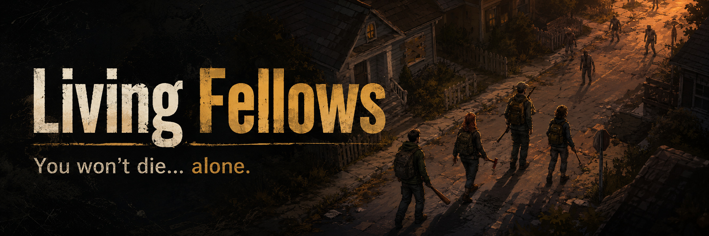
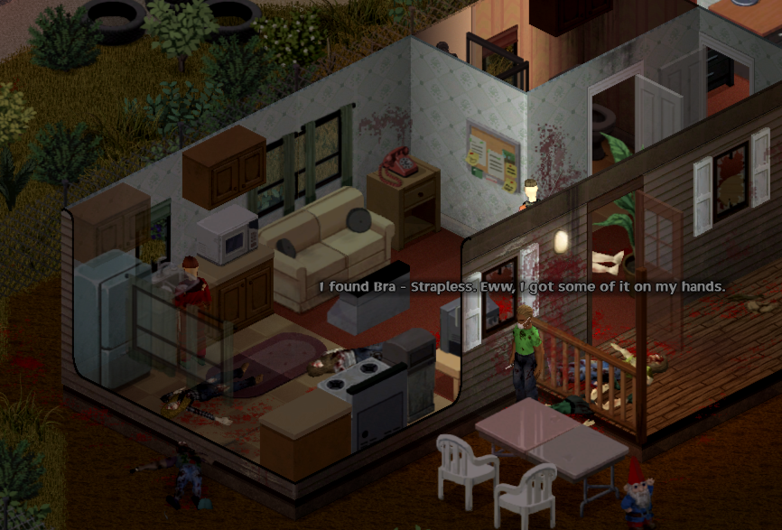

<!-- SPDX-License-Identifier: MIT -->

<p align="center">
  
</p>

# Living Fellows

> ### You won't die... alone.

Persistent companions, survivor households, and living bases for Project Zomboid Build 42.

[](LICENSE)
[](#requirements)
[](CHANGELOG.md)
[](#requirements)

Living Fellows turns the survivors you meet into persistent people. They can join you, fight and travel with you, help run a base, and make their own survival decisions. Companions are native human actors with real inventories, injuries, skills, and permanent death.

**Public playtest for Build 42.21.0, single-player only.** Back up a save before adding the mod. [Choose an install method](#requirements) and follow the [first five minutes](#first-five-minutes).

**Field guide:** [Living Fellows Field Manual](https://thorelvin.github.io/living-fellows/).

## Contents

- [Highlights](#highlights)
- [Requirements](#requirements) · [Install (Workshop)](#install-from-steam-workshop) · [Install (standalone)](#install-with-installbat)
- [First five minutes](#first-five-minutes)
- [Companion panel](#companion-panel) · [Orders](#orders)
- [How companions behave](#how-companions-behave)
- [Expeditions (experimental)](#expeditions-experimental)
- [Base life and production](#base-life-and-production)
- [Survivor households and bandits](#survivor-households-and-bandits)
- [Strange Folk (0.26.35 playtest)](#strange-folk-02635-playtest)
- [Sandbox options](#sandbox-options)
- [Saves and backups](#saves-and-backups) · [Compatibility](#compatibility)
- [Troubleshooting](#troubleshooting) · [Reporting a bug](#reporting-a-bug)
- [Building from source](#building-from-source) · [Repository layout](#repository-layout)
- [Clean-room status and license](#clean-room-status-and-license)

Full change history lives in [CHANGELOG.md](CHANGELOG.md).

## Highlights

- Up to 16 persistent companions with names, professions, traits, personalities, relationships, memories, needs, wounds, equipment, and permanent death.
- Squad movement in formation through doors, windows, fences, stairs, and vehicles, with corner checks, retreat routes, and running escapes.
- Combat that weighs health, stamina, panic, skill, weapons, allies, and escape routes, under a team-wide Rules of Engagement.
- Scavenging, bag management, gear upgrades, eating, drinking, washing, and wound care using the game's own actions.
- A living base with zones, classified storage, roles, watches, chores, repairs, gathering, and production: felling trees, sawing planks, digging graves, collecting and burying the dead, and burning them on a pyre you mark.
- Survivor households that trade, remember how you treat them, and offer contracts, quests, and recruitment, plus rare hostile bandit camps.
- Private diaries: some companions write short entries in a real book about what actually happened to them, including wounds, bites, and the Knox fever. The book stays with them when they die.
- A translucent companion panel, context-menu commands, first-name labels, minimap markers, a base-layout overlay, and a Support page for diagnostics.
- Experimental expeditions: send an existing squad to a building or fishing shore, choose its leader and return time, and watch that leader in a second local view.

## Requirements

Living Fellows targets **Project Zomboid Build 42.21.0** and is **single-player only**. Multiplayer and user-added split-screen players are refused. An experimental expedition may temporarily put its own companion leader in a second local view to load the mission area.

| Method | What you need | Best for |
| --- | --- | --- |
| Steam Workshop | Project Zomboid 42.21.0 and ZombieBuddy 2.3.3 or newer, including its one-time loader setup | Players who already use ZombieBuddy |
| `Install.bat` | Windows and Project Zomboid 42.21.0 | One local installer; no ZombieBuddy or Workshop subscription |

Use only one copy. The Workshop and standalone editions share the mod ID `SurvivorCompanion`.

## Install from Steam Workshop

1. Close Project Zomboid.
2. Subscribe to [ZombieBuddy](https://steamcommunity.com/sharedfiles/filedetails/?id=3619862853) **2.3.3 or newer** and complete the loader setup on its Workshop page. Subscribing alone does not install its Java loader.
3. Subscribe to [Living Fellows](https://steamcommunity.com/sharedfiles/filedetails/?id=3805760339).
4. Start the game, open **Mods**, and enable both.
5. For an existing save, use **More... > Choose Mods** and enable both mods for that save.
6. Back up the save before your first long session.

ZombieBuddy loads approved Java mods outside Project Zomboid's Lua sandbox. Review its installation preview and approve Living Fellows only if you trust this repository and the Workshop item.

## Install with `Install.bat`

The standalone edition does not need ZombieBuddy.

1. Use **Code → Download ZIP** on this repository, or download `LivingFellowsCompanion-<version>-STANDALONE-WINDOWS.zip` from [Releases](https://github.com/thorelvin/living-fellows/releases) if one is available. The complete repository ZIP includes the bridge and installer.
2. Extract the whole ZIP to a normal folder. Do not run the installer from inside the ZIP viewer.
3. Close Project Zomboid.
4. Double-click **Install.bat**.
5. Start the game and enable **Living Fellows** in **Mods** and, for an existing save, under **More... → Choose Mods**.

The installer finds Steam automatically. If Windows denies access to the game folder, run it as Administrator. For a different Steam library:

```powershell
.\Install.bat -GameRoot "D:\SteamLibrary\steamapps\common\ProjectZomboid"
```

It installs the mod under `%USERPROFILE%\Zomboid\mods\SurvivorCompanion`, keeps its bridge under `%LOCALAPPDATA%\LivingFellows`, and backs up `ProjectZomboid64.json` before changing it. It never edits `projectzomboid.jar`. Keep the extracted folder so you can run **Uninstall.bat** to remove the mod and restore the launcher. See [INSTALL.md](INSTALL.md) for the debug playtest variant.

## First five minutes

1. Load a single-player save and press **Home** to open the companion panel. If it is collapsed, click the small **LF** launcher.
2. Meet a survivor, select them in the panel, and choose **Recruit** when offered. Survivors do not join automatically.
3. Use **Orders** to change their behavior. A new recruit starts on **Follow**, **Copy player** movement, and **Ride with player**.
4. Use **Talk** in the panel header or right-click the companion to speak with them. Select **More → Support** for runtime status and a copyable report if something goes wrong.

Peek, Watch, and Steer use rebindable **keypad 1**, **keypad 2**, and **keypad 3**. Their controls are explained [below](#companion-panel).

## Companion panel

The panel is translucent so you can still see the world. It can be docked left or right, collapsed to the **LF** launcher, or toggled with Home (rebindable under Living Fellows in the key bindings).

**Peek and Watch.** Select a companion in the roster, then hold **keypad 1** (rebindable under Living Fellows) to ease the camera toward them. Release the key to ease home. Press **keypad 2** to start or stop a persistent Watch view. You can also right-click a nearby companion and choose **Watch**, then right-click anywhere and choose **Stop watching** to return. The panel may be collapsed. Both views work on the same floor within 16 tiles, compose with normal right-click aim lean, and never transfer player identity: your player keeps moving normally and remains vulnerable.

**Steer.** Hold **keypad 3** (separately rebindable) and point at loaded ground to walk the selected companion toward the cursor. You can hold Peek and Steer together for a scout-and-direct view. Steering owns the companion through the same action supervisor as work and survival: it can interrupt lower-priority activity, cannot steal them from a protected native action, and immediately yields to combat rescue or survival movement. Release the key to restore normal AI control.

| Tab | Purpose |
| --- | --- |
| Status | Health and needs, current action, order, distance, and relationship summary |
| Orders | Direct orders, movement and follow distance, combat doctrine, and scavenging |
| Squad | Group assignment, group orders, movement and fire signals |
| Expeditions | Experimental squad mission planner and active mission status |
| Loadout | Wounds and treatment, inventory, weapon and carry policy, and vehicle status |
| More | Base (camp operations), Factions (households, trade, standing), Journal (history, relationships, memories, goals), and Support (runtime health) |

Use the persistent **Talk** button above the tabs, or right-click a nearby companion and choose **Talk to [name]**. Choose a topic and a line; the companion walks into speaking distance before answering. The view keeps recent dialogue and explains interruptions. Right-click also offers Follow, Stay, Regroup, Retreat, and a link to the full Orders panel.

To check injuries, right-click a nearby companion and choose **Medical Check**, or open their health view from **Loadout**. The game's timed examination opens the patient's body-part panel, where you can treat wounds with your own supplies. The companion waits while you use it and resumes when the panel closes or danger interrupts. A recruited companion within one tile on your floor also appears as a named backpack in the regular loot pane. Selecting it does not put them on a Stay order.

## Orders

- **Main order:** Follow, Stay, or Guard. Guard patrols around its anchor. Inside your camp area, Stay and Guard put the companion on base duty instead; Guard makes it a guard that watches the square you picked. **Regroup** and **Retreat** are immediate emergency actions.
- **World orders:** Right-click the destination, then use **Target actions → Guard here** to anchor the selected companion to that square. On a zombie, **Focus on this zombie** strongly prefers it and **Leave this zombie alone** lowers its priority for twelve seconds. Doctrine, Hold Fire, visibility, safe attack choice, and overrun judgement still apply; a companion may refuse a bad instruction rather than obeying blindly. Focus the same zombie again within four seconds to **push** the order. A push costs that companion morale and stress, works better when trust and bond are high, never overrides a missing escape or support, and is remembered differently if it succeeds or gets them hurt.
- **Assigned objectives:** Right-click a recruited companion and choose **Assign objective** to set a concrete priority such as medical supplies, reading material, gear, shelter, or a proper meal. Their own personal goal is kept and resumes after the assigned objective is completed.
- **Follow distance:** how far behind you the team keeps. When you stop, followers hold formation for a few seconds before they start downtime or scavenging nearby.
- **Movement:** Copy player, walk, sneak, or run. Escapes and combat can override it.
- **Downtime:** companions choose safe reading, rest, repair, crafting, and other available activities using their needs, personality, goals, and recent activity. There is no manual Idle/Craft selector.
- **Scavenging:** on or off.
- **Weapon priority:** best available, melee, firearms, or quiet weapons.
- **Combat doctrine:** Stealth, Close Defense, Ranged Support, or Weapons Free, for one companion or the whole team.
- **Hold fire:** blocks ordinary shots whatever the doctrine allows.
- **Ride with player:** takes free passenger seats and gets out with you. Extra followers wait safely on foot.
- **Allow overload:** lets a companion carry more than its normal limit, up to a cap.

Right-click the world for the **Living Fellows** menu. The selected companion gets **Move here** plus one action for the clicked object: open or close a door, barricade, remove a barricade, dismantle, or **Check room** for an indoor room. Target actions, care, squad signals, base work, and households sit in submenus. Dismissing a companion asks for confirmation.

## Expeditions (experimental)

Use a disposable save for expeditions. Assign one to four companions to a squad on **Squad**, then open **Expeditions**. Choose a leader, **Scout**, **Search**, or **Fish**, the travel route, time before turning home, and combat style. Scout and Search list buildings within 200 tiles; Fish searches for confirmed shorelines within 1,000 tiles. Search also lets you request a supply type and quantity, including **Everything useful** across categories. Review the plan, then select **Send squad**. The leader appears in a second local view while the other members follow.

**Fishing:** For camp work, mark a **Fishing bank** zone on dry ground beside at least two tiles of open water, assign a resident the **Angler** job, and provide a rod and bait. For an expedition, choose **Fish nearby water**, set the catch count, and select a confirmed bank from the shore list. Buildings are not fishing destinations. The leader needs a rod and bait before departure; equipped teammates can fish while the others escort them. The squad turns home after its catch quota, site deadline, or chosen return time.

**Follow roads** is the default: the squad walks the map's streets and plans a fresh road route home. A building far from any mapped street is reached by leaving the streets as close to it as possible and walking up to 100 tiles off-road; the review names any long off-road stretch. If the leader sees a group of more than three zombies per living squad member on the road ahead, the squad plans around it, or turns home when no connected detour exists on the way out. **Head straight for target** takes the direct course and turns home if no path out is found for 30 seconds.

The team can leave without radios. To order an immediate return while they are away, equip a powered walkie-talkie on your character and the leader, tune them to the same channel, then right-click your equipped radio and choose **Return immediately**. The order requires a received transmission; the panel does not show unseen position or health as live facts.

Expeditions remain experimental. A four-member road round trip to a site 180 tiles away passed in a cloned save, but some routes can still stall; a live alternate-road detour remains unverified. The chosen time controls when the squad turns home, not when it arrives. See the [verification ledger](docs/expedition-v5-verification-ledger.md) for observed results and open checks.

## How companions behave

### Movement

Followers keep formation slots instead of stacking on you. Each fireteam puts a close fighter at point, firearm support in the middle, and a cautious survivor at the rear. They file through doors, windows, fences, and stairs, then spread out again. They check blind corners, climb fences and walls with the player's own actions, route around vehicles, furniture, and crowds, and remember the way back outside. When danger closes in they back off or strafe on safe ground, and turn and run when they are overrun.

In clear conditions companions spot zombies up to 24 tiles away. Each companion must see the target for itself: walls, closed doors, and other floors block sight, and noise behind a wall only produces an uncertain warning.

### Combat

Companions fight with the game's own attack animations and weapon timings. They weigh wounds, stamina, panic, pain, morale, skill, weapon condition, support, and escape routes. They split targets, avoid friendly fire, shove when it is safe, finish grounded zombies, and cover a retreat. When one decides a fight is too dangerous, it may say the actual dominant reason--such as exhaustion, encirclement, wounds, bad footing, no escape, or an empty weapon--instead of silently refusing or giving only a generic retreat call.

A wall, closed door, barricade, closed window or tall fence between a companion and its target stops a swing, shove or stomp; the companion moves to an opening instead. Under Weapons Free a melee swing may still go through a closed, unbarricaded window.

Zombies hunt companions like players. Bites can infect and turn them, and a swarm can pin a companion to the ground unless you thin it in time. Combat calls make real noise; under Stealth doctrine companions use silent hand signals when they can.

### Scavenging and equipment

A scavenger chooses containers by distance and room before seeing their contents. Once a container is open, they keep taking useful items from it instead of walking away after one item. Each transfer finishes its rummage animation and is verified. Previously searched containers can still be worth their time; empty ones are skipped for a while.

Inside camp, companions use marked storage and respect its reserves. They leave unmarked containers and Memorial storage alone. They manage backpacks, gear and clothing, loot dead zombies when safe, and carry useful materials home. In the dark, a companion with a flashlight can use it in the off hand and replace a spent battery. A two-handed weapon leaves no hand free for the light.

Open a nearby recruited companion in the regular loot pane to give them equipment. They review a gifted usable weapon, better clothing or bag when it is safe, including items marked as favorites. Right-click an item in their inventory and choose **Equip on** or **Wear on** to select that exact item for the companion. An explicit choice stays in place while the gear remains usable.

<p align="center">
  
</p>

<p align="center"><em>A scavenger reports what it pulled off a body, in its own voice.</em></p>

Now and then, when a spot has been quiet for a while, a companion crouches over a dead zombie nearby and talks through what it sees: the clothes, what the infection did to the person, and what Knox Knews and the radio said back in July 1993. Every companion does it in its own voice, which might be a quiet word, a civil-defense joke, or something about Kentucky. Doctors, nurses, police, and other hands-on professions are more curious. Cautious companions keep their distance, and a badly stressed one never looks. Each body gets one look.

Sometimes a companion stops at a body for a different reason. It crouches and says a few quiet words, and if the dead carried a keepsake such as a photo or a locket, it mentions it and leaves it where it lies. Caring companions do this most, and more often right after a fight. A friend nearby may say something back.

### Needs, medicine, and death

By default hunger and thirst rise at half the player rate. Companions eat, drink, use clean water, fetch from camp storage, tear cloth into bandages (or use a dirty rag when nothing clean is left), treat themselves, and help an injured player when it is safe. Death is permanent and follows the game's own corpse and reanimation rules. A known bite can lead to concealment, confession, quarantine, exile, or a farewell; lethal decisions always need your confirmation. Those who learn of it walk over and talk it through face to face. A bitten companion may first confide in the one it trusts most, which might be you, and a protective friend might keep the secret for a while.

At 90% verified Knox progress, a living companion develops a worsening shamble using the game's heavy-limp walk blend. While settled on a bed, they occasionally make a short zombie-like groan. These signs stop if the Knox infection clears; other illnesses do not trigger them.

Companions now volunteer when native hunger, thirst, or fatigue crosses a noticeable, serious, or urgent threshold. They say it once per escalation instead of every decision tick, wait through danger and speech cooldowns, and can speak again only after the need improves and later returns. Asking about status still uses the separate direct-answer dialogue.

### Personality and relationships

Every survivor has a profession, trait, personality, history, keepsake, preferred camp role, personal goal, and sometimes a nickname. About one in eight arrives with one; friends coin others in passing, and deeds earn names such as Slugger, Reaper or Nine Lives. Right-click a recruited companion for **Give nickname...** or **Clear nickname**, and untick **Show nicknames** under **More** for plain names. Trust, bonds, morale, stress, memories, grief, and relationships persist, and dialogue reacts to what actually happened. Stress can show as venting, pacing, arguments, withdrawal, or a breakdown; good morale gives small boosts. Danger interrupts all of it.

Companions also talk in their own voice. Two idle companions at camp, including followers and anyone standing in the camp's logging, farm, burial or pyre areas, may turn toward one another for a short exchange, and a companion who meets a calm, non-hostile survivor says hello and gives them room to answer. A surrounded companion may yell a deadpan fake distraction at the zombies, a follower makes the odd remark while you walk, one of them cracks a joke when you stand still for a few minutes, and the first walk into a notable place, such as a police station, church, bar, hospital, or gun store, earns a remark. Former police officers, doctors, nurses, and other professions have lines of their own for places like their old workplaces. Conversation is spaced out so it never becomes a chorus, and danger interrupts it.

Combat, danger, and hand-signal lines also remember what nearby companions just said, so a squad does not echo the same shared bark. The high-frequency kill pool is deeper, while stress and joy lines now vary by brave, cautious, caring, practical, and stressed voices. Farmers comment occasionally when preparing ground, sowing, watering, harvesting, treating or losing a crop, or discovering that the tools are unusable; those remarks never gate the work.

Ordinary moods have their own voice now too. Steady companions answer routine work and waiting with dry understatement; low spirits color rain, fog, dawn, and dusk with sparse observations; hopeful survivors read abandoned notices and familiar buildings with obsolete civil-defense confidence. Brave companions may use sharper gallows humor after a confirmed kill, but only once the encounter is genuinely clear—active threats and an overrun retreat strip those jokes from the available lines without suppressing useful tactical speech.

Native stress and panic can also show in what they say. A companion may react to a frightening sound that did not affect you, narrate the onset or recovery of panic, or ask for cigarettes when a smoker's withdrawal rises. Deaf survivors do not react to unheard sounds, combat refusals get first claim on the speech window, and these observations are flavor only: environmental stress never changes the separate relationship stress value or any AI decision.

Companions also remember their best fights. Four kills in one fight, or a kill after being pulled down, becomes a story. The companion tells it later, when things are calm at the base or you have stood still for a minute. Every retelling grows the numbers and the title, from "that thing at the gas station" to "the Legend of the Gas Station". A companion who was there may correct it, but the teller never backs down.

Companions have body language too. They yawn late at night, and the yawn spreads to whoever stands nearby. They stretch after sitting and first thing in the morning at base, and sneeze in dusty storerooms or cough in the cold. They remain seated while reading or writing a private diary, prefer usable furniture when tired, and can take a short rest on the floor when no seat or bed is available. A companion who rests on a bed, cot or the floor with a book or its diary to hand reads or writes there before getting up. Athletic companions do a short workout at base in the morning, and others sometimes join them. It is all animation, with no sound and no effect on stats.

### Private diaries

Some companions keep a diary. When a companion joins, the game decides once whether they are a diary keeper (about one in three by default) and saves that choice. A diary keeper carries a book named after them, plus a pencil if they had nothing to write with. Now and then, in a quiet safe moment, they open the book for a few seconds and write a short entry. They write at most once a day, usually every day or two.

Every entry is about something that really happened to that companion: joining you, a scratch, cut, burn, fracture or bite on their own body, being bandaged by you or by someone else, getting out of danger with you, a friend's death they grieve, and the Knox virus. That means a bite they are hiding or have confessed, a fever that gets worse, the group's decision about them, or learning that someone else was bitten. A companion only writes what they could know. A hidden infection stays out of the book until they feel the fever, and help is credited only to whoever actually gave it. They also write about everyday life, the funny and the grim. That includes the first time the party walks into a police station or a Spiffo's, a zombie they studied in a Santa suit, and a fight story whose number keeps growing each time they tell it (the diary keeps the real count). It includes praise and pep talks, workouts and repairs, planks sawn, a week together, and quiet days shaped by the rain, the season, hunger or a cold. On the darker side: watching a friend get hurt, arguments and breakdowns, burying strangers, burning bodies, burying a friend by name, and carrying out a mercy decision. Each keeper has their own voice (plain and guarded, warm, blunt, or wry and watchful), and a later entry may quote an earlier page when their view of you has really changed. If an entry is interrupted, nothing is written.

A page is never rewritten, and nothing is written after the author dies. The book stays with them, on the body, in a bag or wherever they left it. Right-click the book and choose **Read** to open it. Reading a living companion's diary asks you to confirm first, since it is private. Reading gives no experience or other reward. A book holds 60 entries. Diaries can be turned off, and the keeper chance changed, on the sandbox page.

## Base life and production

**Setting up a camp.** Right-click the desired ground tile and choose **Living Fellows → Base life → Set camp core here**. The camp area starts as a 25 by 25 tile square centred on the core. A camp that still has the older 13 by 13 or 15 by 15 default area grows to 25 by 25 when the save loads; a camp area you drew yourself keeps its size. To draw a zone, right-click its first tile and choose **Start zone here**, move the mouse to preview the rectangle, then right-click the final tile. That second right-click locks the rectangle while you move through the menu to **Finish zone here**; the player's position is never used. With **Show base layout** enabled, right-click a zone to remove it; a zone that is still needed says why instead. To move the camp, choose **Abandon camp** from the same menu or at the end of **More → Base**, confirm, then set a new camp core. Running camp work is stopped, anything a companion was carrying for the camp stays with it, and residents stay where they stand; buildings and stored items remain. Use **Mark storage as...** on containers. Categories include **Books & magazines** for a camp library and **Farming supplies** for seed, tools, compost, water cans, and crop treatments. Companions help themselves from marked storage and leave unmarked containers in the camp to you. Assign residents, roles, and policies in **More → Base**.

Zones include the camp boundary, work area, lumber area, farm area, burial ground, pyre, rest, social, guard, rally, and quarantine areas. Every zone lies inside the camp except lumber areas, farm areas, burial grounds, and pyres, which may also lie up to 30 tiles beyond the camp boundary. A pyre is at most nine tiles and must pass a fire-safety check when you draw it.

**Floors and stairs.** A complete staircase inside the camp area automatically extends the camp boundary to the connected floor, above or below, including a basement. This also happens after you build stairs, once the stair and landing tiles are loaded. The generated area follows the current camp rectangle and admits only tiles with a real floor; use **Show base layout** to inspect it. You can remove the generated area to stop this automatic extension on that floor, or draw your own area there. Mark upper-floor storage normally so residents can use it. A woodcutter can work in a marked lumber area outside camp, then use the stairs to carry logs to storage on a connected floor.

Residents on base duty sort storage, repair gear, craft supplies, keep watch, patrol, maintain barricades, and build queued construction. They put spare carried literature into nearby Books & magazines storage even when they are not overloaded, but keep it if no library is marked. During a quiet spell they can borrow an unread book or magazine from that storage, read it, and put that exact item back; storage reserves, private diaries, favourites and other protected belongings are left alone. Immediate danger interrupts reading and returns a borrowed book. Giving Stay or Guard inside the camp area also puts a companion on base duty. A guard on shift keeps watch around its post instead of taking general chores.

**Farming.** Draw one or more Farm areas over existing vanilla plots; companions never turn untouched ground into fields. The bounded farm audit rotates across every marked area and queues the most urgent work it sees, using stable area and tile order for ties. Any on-duty resident can tend them, while the Farmer role is preferred and completes farm actions 40% faster. Real Farming skill still determines crop yield and is required at level 3 for disease treatment. Residents borrow and return exact supplies, keep enough seed for every non-regrowing plot plus two spares, wait for seed stage when reserves are short, use compost rather than chemical fertilizer, and route crops and seeds to marked storage. Routine work is daylight-only. A remote Farm area gets no travel or work at night; an inside-camp plot may still be harvested or emergency-watered. Water may come from the camp or the active Farm area, preferring rain or tainted water and using clean water only in an emergency.

To see the base layout, press Insert (rebindable under Options, Key bindings, Living Fellows), use right-click, Living Fellows, Base life, or use the button in the Base tab. Each zone gets a see-through floor tint and outline in its colour, registered storage gets a tile and outline in its category colour, and a legend lists what is on screen.

**Gathering.** Residents can still finish gathering orders already in the save. The Base view shows their progress without asking you to manage quantities, destinations, or workers.

**Choose a base job.** Select a companion in **More → Base** and choose one job from the dropdown near the top. This puts them on base duty. Choose **No base job (follow me)** to bring them back. Their job survives a save and reload. They take work when the existing survival and work scheduler gives them time, and the Base view shows active production and blockers without an order form.

Woodcutters choose a marked lumber area with standing trees and make small logging orders when stored logs are low. Carpenters saw stored logs into planks when a separate output container is available. Gravekeepers look for bodies in the camp or lumber areas and use a marked burial ground, or a safe marked pyre. Farmers tend marked plots. Maintainers handle damaged barricades among marked maintenance targets. Quartermasters, medics, guards, and generalists use the existing base chores. The marked areas and storage are one-time places and safety boundaries; you no longer set a quantity, area, destination, or worker for each production order.

Tools and materials come from camp storage. The underlying work actions remain finite so a resident can pause, recover, and choose the next task safely.

| Base job | You need | What happens |
| --- | --- | --- |
| Woodcutter | A lumber area, axe, and marked construction, general, or output storage | Scans a few loaded tiles at a time, chops one standing tree with the game's own action, and hauls its logs to storage. |
| Carpenter | Logs in marked storage, a saw, and a second marked container for planks | Takes one log, saws it into three planks with the vanilla recipe, and stores them. Completed output is recovered after a pause or reload. |
| Gravekeeper | A burial ground and shovel, or a safe pyre with lighter and petrol | Finds a body within the camp or lumber areas, drags it to the burial ground or pyre, then buries or burns it. Burial can dig and fill a grave as needed. Bodies carrying items are left for you to loot. |
| Farmer | A farm area over existing plots and marked farming supplies | Uses the existing bounded field audit to find watering, tending, and harvest work. |
| Maintainer | Marked maintenance targets | Takes damaged barricade work when one needs planks. |

- Chopping is loud. No tree is started while danger is visible nearby, winded residents rest, and a chop that gets stuck is abandoned after three minutes.
- Outside the camp boundary, residents start no new tree and fetch no body at night (21:00–06:00).
- Bodies still carrying items are left for you to loot unless the order handles them with their belongings.
- A resident dragging a body takes no fences, windows, or stairs, and drops it at once when danger shows up. The body stays where it fell.
- Fire is real. A pyre must be outdoors on open ground, away from buildings, stored goods, trees, vehicles, and loose items. Nothing is lit in the rain unless you allow it, nobody else may stand close to the body being lit, and if fire appears beyond the pyre every worker stops and the order waits for your Retry.
- A fallen companion found by Collect the dead gets an empty grave of their own and always a cross, and the grave keeps their name. Fallen companions are never burned. A body whose identity is not certain is treated as a stranger, and your own body is never touched.
- A blocked order shows the reason and tries again on its own; a spreading fire stops disposal until the area is safe.
- Any other base job waits a little longer after each failure, up to ten minutes. After six failures in a row it stops trying and appears under **Stalled jobs** in the Base view, with its reason and **Retry** and **Cancel** buttons.

Every closed grave gets a few words: a short prayer or a line of bleak gallows humor depending on who holds the shovel, a salute, and sometimes an "Amen" from a friend nearby. Lighting a pyre may earn a "Burn, baby, burn!" or "Disco inferno!", a burned-out pyre gets its own prayer or gallows line, and a fallen companion's grave closes with their name instead of a joke.

## Survivor households and bandits

Households of one to three survivors occupy real houses, barricade them, warn strangers, and defend their territory. They remember theft, damage, help, and murder. A household can trade when it has a real shortage, share imperfect rumors, offer contracts and quests, grant temporary access, and eventually let one resident try out as your companion. What you learn appears in **More → Factions**, and quest targets are marked on the world map.

Bandit camps are rare, always hostile, and appear from day four. Bandits guard and patrol their camp, need line of sight to target you, and fight zombies too. They never trade or recruit.

## Strange Folk (0.26.35 playtest)

The 0.26.35 playtest adds 65 rare, one-off characters to the household system. From the third day, one may settle into a fitting building near you every three days by default, at most two stories at a time; each appears once per save and only around you, never to an expedition. Right-click near one for **Living Fellows → Strange Folk**. Gale Mercer runs a GigaMart checkout and notices unpaid items. Butch Kittredge offers a steak until you enter his back room. Cecil Ray Haskins warns armed visitors away from his gun-shop counter. Hollis Burkett cares for Duchess, a real named sow. Delbert Sloan barricades Room 12, trades through its door, and keeps Sweet Pea inside. Ranger June Whitlock knows all ten of her named rabbits and may ask you to find an escaped Juniper. Other Strange Folk include the Gut-Cloaked Man, Window Spiffo, and Shotgun Farmer.

Walt Reed keeps a forest campfire, a fishing kit and a story to trade by the fire. Eli Rourke calls from a locked garage with a broken leg, and Nate Duvall calls from a closed room without clean water. Their 90 MHz distress calls reach any powered portable radio you hold or wear, tuned to 90 MHz with the volume up, while the survivor is loaded nearby and more than three tiles away. Storm static can garble a call; they call again within two minutes. Answer with a working two-way radio to mark the location. Eli needs a real splint and clean bandage through Medical Check. Nate needs clean water from your inventory and time to recover. These encounters use the existing faction standing, native animal, inventory transfer, barricade, navigation, combat, and recruitment systems.

## Sandbox options

The **Living Fellows** sandbox page controls:

| Option | Effect |
| --- | --- |
| Spawn independent survivors, frequency | Whether and how often new survivors appear |
| Maximum active companions | Limit for new recruits and encounters (up to 16) |
| Companion hunger and thirst rate | 0 disables, 0.5 is the default, 1 matches the player |
| Spawn new survivor households, daily chance, maximum | Household spawning |
| Spawn bandit camps, daily chance, maximum | Bandit camp spawning |
| Companion menu opacity | Panel background opacity |
| Show companion first names | Name labels above companions you can see |
| Companions keep private diaries, diary keeper chance | Whether some companions write diaries, and the chance (35% by default), decided once per companion |
| Rare intrusive-thought banter, companion profanity | Optional rare stray thoughts and stronger language; both are on by default |
| Strange Folk encounters, days between Strange Folk encounters | Whether new Strange Folk appear (on by default), and the wait between them, 1 to 14 days (3 by default). Strangers already met stay in the save. |
| Companion nicknames, rare famous namesakes | Whether companions bring, earn and use nicknames (on), and whether a very few new survivors share an exact name with a fictional zombie-story character (off) |

Lowering a limit never deletes companions, households, or camps already in the save. Turning diaries off never removes a book or its pages.

## Saves and backups

Companions, households, relationships, contracts, bases, and production orders are saved with the world, so they survive the death of your character.

Before installing or updating:

1. Close the game.
2. Copy your save folder from `%USERPROFILE%\Zomboid\Saves` somewhere safe.
3. Keep at least one backup from before your first Living Fellows session.

Do not remove the mod from an important save without a backup.

## Compatibility

- Supported game version: **42.21.0**.
- Single-player only; multiplayer and user-added split-screen players are refused. An expedition may create its own second local view for the leader.
- The Workshop edition requires **ZombieBuddy 2.3.3 or newer**.
- The standalone edition is Windows-only and uses its bundled bridge.
- Mods that replace player actor construction, animation ownership, pathfinding, vehicle passenger state, UI key bindings, or the same launcher `mainClass` may conflict.
- The default panel key is **Home**. Rebind it or report a conflict if another mod uses it.
- The default Peek hold key is **keypad 1**. **Keypad 2** toggles Watch, and **keypad 3** holds Steer. All three are separately rebindable under Living Fellows.
- No Project Zomboid game file is redistributed or patched in place.

## Troubleshooting

### The panel is missing

Press Home once, then look for the small **LF** launcher at the edge of the screen. Confirm Living Fellows is enabled for the current save. Check the [installation steps](#requirements) for your chosen edition.

### Runtime active is off or the native bridge is missing

Workshop users: verify ZombieBuddy is enabled for the save **and** its one-time loader setup is complete. Its startup watermark alone does not prove that Living Fellows' Java bridge loaded. Standalone users: close the game, rerun the latest `Install.bat`, then open **More → Support** and copy the report. Do not enable both editions together.

### A companion is only a moving shadow

The native actor bridge did not load or failed its health check. Open **More → Support** and copy its report. Do not continue a valuable save until companions render correctly.

### A companion is stuck

Wait a moment for automatic recovery, then use **Regroup**. If it stays stuck, note what is in the way (door, gate, fence, vehicle, stairs, or furniture) and the current order and movement setting, and send the Support report, logs, and a screenshot or short video.

### Workshop and standalone copies conflict

Remove one copy. Keep only one `SurvivorCompanion` mod folder, restart the game, and enable the remaining copy for the save.

### Standalone uninstall cannot restore the launcher

Close Project Zomboid and rerun `Uninstall.bat` from the same release folder. Its backup lives under `%LOCALAPPDATA%\LivingFellows`; do not delete that folder until the uninstall succeeds.

### Standalone install says the owned bridge manifest exists but SCLauncher is inactive

A game reinstall can restore the vanilla launcher while leaving the standalone bridge record behind. The current installer recovers this state when the original launcher backup and installed bridge still verify. Close the game and rerun `Install.bat` from the latest complete download. If it still refuses recovery, keep `%LOCALAPPDATA%\LivingFellows` intact and report the exact error and `ProjectZomboid64.json`; the installer is refusing a launcher state it cannot verify.

## Reporting a bug

Use the repository's [bug report form](https://github.com/thorelvin/living-fellows/issues/new/choose). Include:

- Living Fellows version and installation method;
- exact Project Zomboid version;
- new or existing save;
- other enabled mods;
- what you expected and what happened;
- steps to reproduce, if known;
- screenshots or a short video for visual or pathing problems; and
- the relevant logs.

Windows log locations:

```text
%USERPROFILE%\Zomboid\console.txt
%USERPROFILE%\Zomboid\logs.zip
```

Remove server addresses, usernames, chat, and other personal information before posting logs publicly.

## Building from source

Building and testing require Project Zomboid 42.21.0 installed locally, a Java 17 JDK for the reproducible bridge build, and Python 3.12+. The repository includes the versioned bridge JAR, so a source archive can also use `Install.bat` directly.

Run the complete test gate:

```powershell
powershell -NoProfile -ExecutionPolicy Bypass -File .\scripts\Test-Project.ps1
```

The stages run in parallel, and the core Kahlua harnesses and the installer's
fault-injection cases each fan out again inside their own stage. `-Jobs N` sets
how many run at once (it defaults to the processor count, capped at 8) and
`-Serial` runs everything one at a time, which is the thing to reach for when a
parallel run reports something that does not make sense on its own.

Build the Workshop upload package or the standalone Windows package:

```powershell
powershell -NoProfile -ExecutionPolicy Bypass -File .\scripts\Build-Workshop.ps1 -Channel release
powershell -NoProfile -ExecutionPolicy Bypass -File .\scripts\Build-Standalone.ps1
```

The standalone builder installs and uninstalls the package against an isolated fake game folder and writes a ZIP plus SHA-256 checksum under `build\release`.

Maintainers can run the real-engine sandbox tests with the game closed. They work on a cloned save and never touch a normal save in place:

```powershell
powershell -NoProfile -ExecutionPolicy Bypass -File .\scripts\Invoke-LiveSandboxTests.ps1
```

For a private local playtest, `scripts/Start-LocalPlaytest.ps1` launches the installed build with local mods ahead of older Workshop staging copies for that launch only.

## Repository layout

| Path | Contents |
| --- | --- |
| `SurvivorCompanion/` | The mod payload |
| `bridge/` | Java bridge source for the native companion actor |
| `scripts/` | Build, install, uninstall, packaging, and test automation |
| `tests/` | Lua, Java, PowerShell, static, UI, and sandbox tests |
| `assets/` | Project artwork and release images |
| `Workshop/` | Steam Workshop metadata and upload staging |
| `docs/` | Architecture, provider, safety, and subsystem notes |

Read [ARCHITECTURE.md](ARCHITECTURE.md) and [CONTRIBUTING.md](CONTRIBUTING.md) before changing actor ownership, native actions, persistence, or player-state isolation.

## Clean-room status and license

Living Fellows is an original clean-room implementation. It contains no code from the earlier inspiration mod, no copied third-party Lua, no decompiled Project Zomboid source, and no proprietary game assets. Project Zomboid belongs to The Indie Stone; this unofficial mod is not affiliated with or endorsed by The Indie Stone.

Living Fellows source and original project assets are released under the [MIT License](LICENSE).
